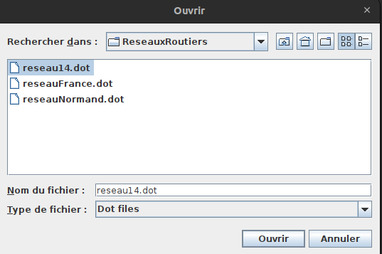
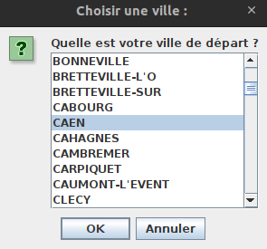
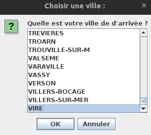
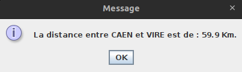

[![Contributors][contributors-shield]][contributors-url]
[![Forks][forks-shield]][forks-url]
[![Stargazers][stars-shield]][stars-url]
[![Issues][issues-shield]][issues-url]
[![LinkedIn][linkedin-shield]][linkedin-url]

<!-- PROJECT LOGO -->
 

  

  <h3 align="center">GPS</h3>
 

  

<!-- TABLE OF CONTENTS -->

  
Table of Contents

  <ol>
    <li>
      <a href="#about-the-project">About The Project</a>
      <ul>
        <li><a href="#built-with">Built With</a></li>
      </ul>
      <li><a href="#usage">Usage</a></li>
    </li>
  </ol>

<!-- ABOUT THE PROJECT -->
## About The Project

This is a school project, completed in the first year of a computer science degree program (BUT Informatique).
The goal was to create a GPS in Java using graph traversals.
Dijkstra and depth-first and breadth-first traversals were the main algorithms used in the development of this GPS.

(<a href="#readme-top">back to top</a>)

### Built With

* [![Java][Java]][Java-url]

(<a href="#readme-top">back to top</a>)

<!-- USAGE EXAMPLES -->

### Usage

## Choose a .dot file

## Select the starting city

## Select the destination city

## Then the distance between the two cities is calculated

## View the path details

(<a href="#readme-top">back to top</a>)

## Contact

Romain LECOUVREUR - [@LinkedIn](https://www.linkedin.com/in/romain-lecouvreur-1848b2239/) - lecouvreurromain@gmail.com

Project Link: [https://github.com/RomainLvr/GPS](https://github.com/ROmainLvr/GPS)

(<a href="#readme-top">back to top</a>)

[contributors-shield]: https://img.shields.io/github/contributors/RomainLvr/GPS.svg?style=for-the-badge
[contributors-url]: https://github.com/RomainLvr/GPS/graphs/contributors
[forks-shield]: https://img.shields.io/github/forks/RomainLvr/GPS.svg?style=for-the-badge
[forks-url]: https://github.com/RomainLvr/GPS/network/members
[stars-shield]: https://img.shields.io/github/stars/RomainLvr/GPS.svg?style=for-the-badge
[stars-url]: https://github.com/RomainLvr/GPS/stargazers
[issues-shield]: https://img.shields.io/github/issues/RomainLvr/GPS.svg?style=for-the-badge
[issues-url]: https://github.com/RomainLvr/GPS/issues
[license-shield]: https://img.shields.io/github/license/RomainLvr/GPS.svg?style=for-the-badge
[linkedin-shield]: https://img.shields.io/badge/-LinkedIn-black.svg?style=for-the-badge&logo=linkedin&colorB=555
[linkedin-url]: https://www.linkedin.com/in/romain-lecouvreur-1848b2239
[Java]: https://img.shields.io/badge/java-000000?style=for-the-badge&logo=java&logoColor=white
[Java-url]: https://www.java.com/fr/
