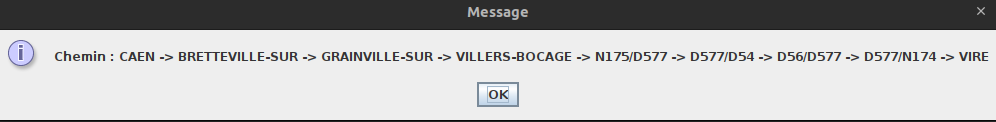

[![Contributors][contributors-shield]][contributors-url]
[![Forks][forks-shield]][forks-url]
[![Stargazers][stars-shield]][stars-url]
[![Issues][issues-shield]][issues-url]
[![LinkedIn][linkedin-shield]][linkedin-url]

<!-- PROJECT LOGO -->
 

  

  <h3 align="center">GPS</h3>
 

<!-- TABLE OF CONTENTS -->

  
Table of Contents

  <ol>
    <li>
      <a href="#about-the-project">About The Project</a>
      <ul>
        <li><a href="#built-with">Built With</a></li>
      </ul>
      <li><a href="#usage">Usage</a></li>
    </li>
  </ol>

<!-- ABOUT THE PROJECT -->
## About The Project

This is a school project, completed in the first year of a computer science degree program (BUT Informatique).
The goal was to create a GPS in Java using graph traversals.
Dijkstra and depth-first and breadth-first traversals were the main algorithms used in the development of this GPS.

(<a href="#readme-top">back to top</a>)

### Built With

* [![Next][Java]][Java-url]

(<a href="#readme-top">back to top</a>)

<!-- USAGE EXAMPLES -->
## Choose a .dot file

## Select the starting city

## Select the destination city

## Then the distance between the two cities is calculated

## View the path details

(<a href="#readme-top">back to top</a>)

## Contact

Romain LECOUVREUR - [@LinkedIn](https://www.linkedin.com/in/romain-lecouvreur-1848b2239/) - lecouvreurromain@gmail.com

Project Link: [https://github.com/ROmainLvr/GPS](https://github.com/ROmainLvr/GPS)

(<a href="#readme-top">back to top</a>)

